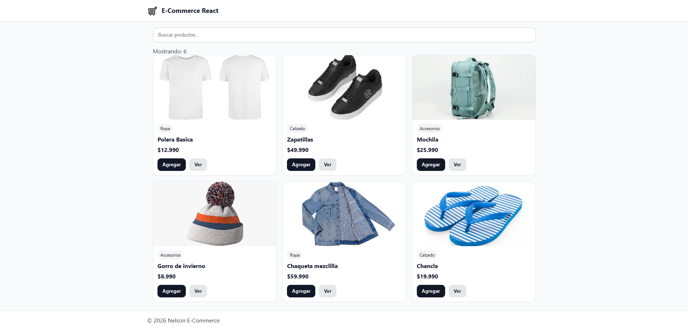
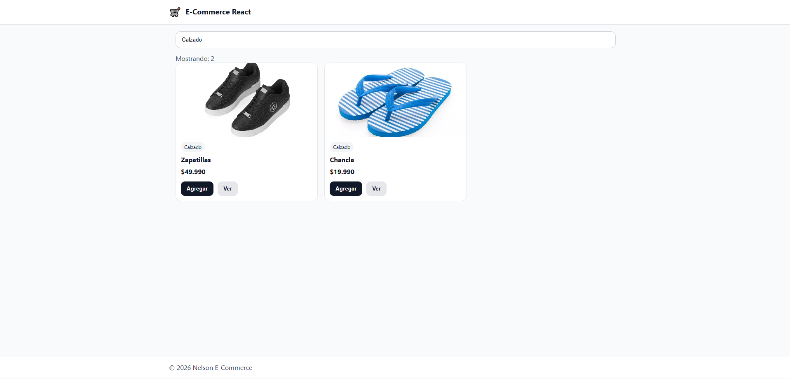

# E-Commerce React

## Descripción
Proyecto base de un e-commerce hecho con React. Muestra un listado de productos usando datos simulados y permite buscar productos por nombre o categoría.

## Componentes creados
- Header
- Footer
- Button
- ProductCard
- ProductList
- SearchBar

## Instrucciones para ejecutar el proyecto
1. Clonar el repositorio:
   ```
   git clone https://github.com/Nelruu/E-Commerce-React.git
   

## Funcionalidades
- Renderiza un listado de productos
- Buscador por texto (filtra por nombre y categoría)
- Componentes reutilizables dentro de `/components`

## Tecnologías usadas
- React
- Vite
- JavaScript
- CSS

## Capturas
### Imagen de la pagina principal


### Imagen con solamente el calzado filtrado desde la barra de busqueda

